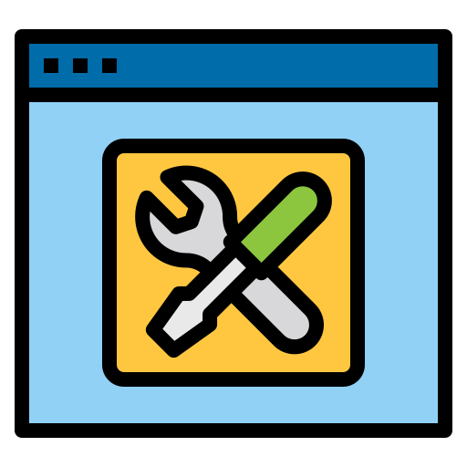

<p align="center">

</p>
<h2 align="center">DevLab</h2>
<p align="center">
DevLab is a Flutter application with several tools to assisst developers in thier developement journey.
t's inspired by <a href="https://github.com/gumbarros/DevWidgets">DevWidgets</a>. which is inspired by <a href="https://github.com/veler/DevToys">DevToys</a>.<br>

<!-- <a href="https://gumbarros.github.io/DevWidgets">Clicking here</a> you can try it directly from your browser 🌐! -->
</p>
<!-- <p align="center">
  <a href="https://github.com/Codelessly/ResponsiveFramework">
    
  </a>
  <a href="https://github.com/gumbarros/DevWidgets/releases/tag/latest">
    
  </a>
  <image src="https://user-images.githubusercontent.com/52143624/201690529-58c277d6-91f1-466a-b076-da680a0f2a9d.png" alt="DevWidgetsHome">

</p> -->

---

## Getting Started

<!-- ### Download from Releases

You can download a nightly build for Linux from the latest commit
from [here](https://github.com/gumbarros/DevWidgets/releases). -->

### Building from source

1. Clone the repo from GitHub

```bash
git clone https://github.com/gumbarros/DevWidgets
```

2. Install [Flutter](https://docs.flutter.dev/get-started/)
3. Restore the dependencies

```bash
flutter pub get
```
4. Build for your OS
```bash
# Windows
flutter build windows --release
# Mac
flutter build macos --release
# Linux
flutter build linux --release
```
---

## Contributing

Check [CONTRIBUTING.MD](https://github.com/gumbarros/DevWidgets/blob/main/CONTRIBUTING.md).

---

## Special Thanks

### Code contributors

<br>
<a href="https://github.com/ahmeduday/devlab_flutter/graphs/contributors">
Contributers
  <!--  -->
</a>
